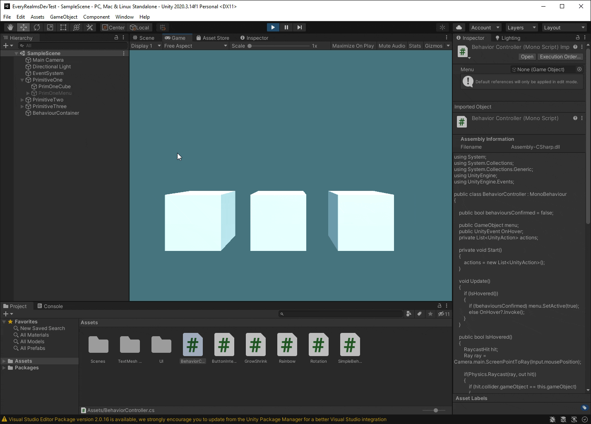

## EveryRealmsDevTest

Unity Developer Test for Every Realms Studios

The goal of this test was to create a modular system for adding custom behaviours to game objects.
I created a custom simpleBehaviour class that all custom behaviours need to implement. This and the behaviour event class
handles all behaviour application under the hood. Once a simple behaviour is made, it just needs to be added to the Behaviours gameObject as a
component and custom button needs to be added to the UI referencing that behaviour, that behaviour will now be added to that object if selected
from the menu and will function whenever the object is hovered over.

